

Para CGO (env CGO_ENABLED=1) en Windows el SDK  de Go espera encontrar un compilador estilo GCC (p. ej. MinGW-w64 o MSYS2).

<!--more-->

En este caso la opción recomendada es **[MinGW-w64](https://www.mingw-w64.org)** ya que si se opta por una opción como [MSYS2](https://www.msys2.org/) se necesita instalar tambien una versión de MinGW-w64 GCC.

Para obtener MinGW-w64 ir a la sección de descargas del sitio [mingw-w64.org/downloads](https://www.mingw-w64.org/downloads) e ir al apartado de "[MinGW-W64-builds](https://www.mingw-w64.org/downloads/#mingw-w64-builds)"

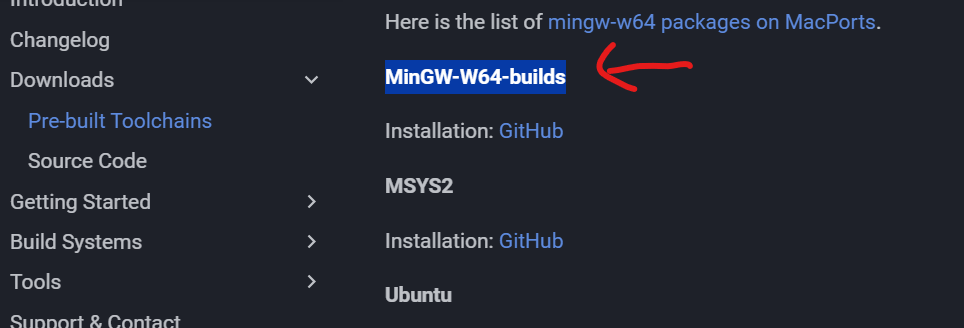

En esta parte la forma amigable para saber que descargar y elegir en el proceso es por medio del instalador en linea que se menciona en el README del repositorio de "[MinGW-W64-builds](https://www.mingw-w64.org/downloads/#mingw-w64-builds)" > [github.com/niXman/mingw-builds-binaries/releases](https://github.com/niXman/mingw-builds-binaries/releases)

[github.com/niXman/mingw-builds-binaries](https://github.com/niXman/mingw-builds-binaries) > **mingwInstaller.exe**

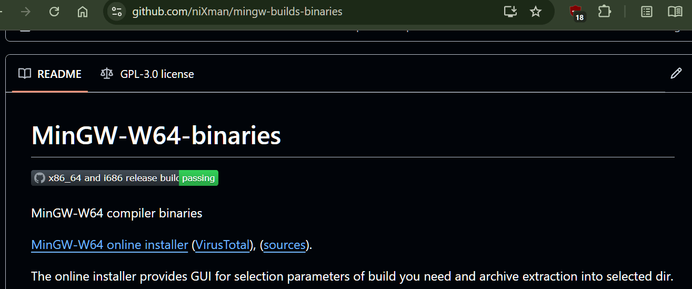

## Opciones para **mingwInstaller.exe**

Ahora usando el instalador en linea se muestran las opciones a usar para la descarga, instalación y configuración de MinGW-w64.

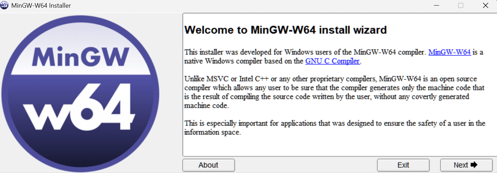

### 1. Seleccionar la opción de versión más reciente:

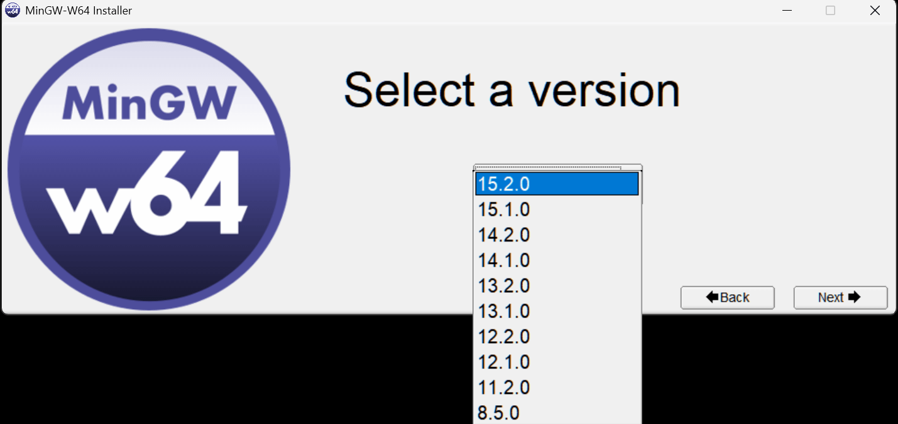

### 2. Seleccionar la arquitectura de procesador en uso:

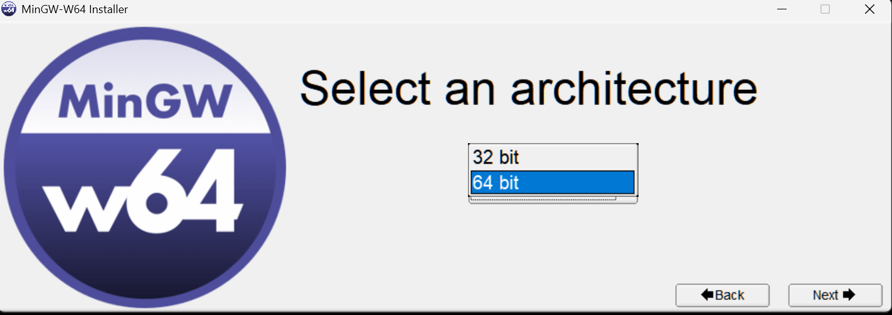

### 3. Seleccionar el modelo de hilos para la librería estándar de C (thread models toolchains):

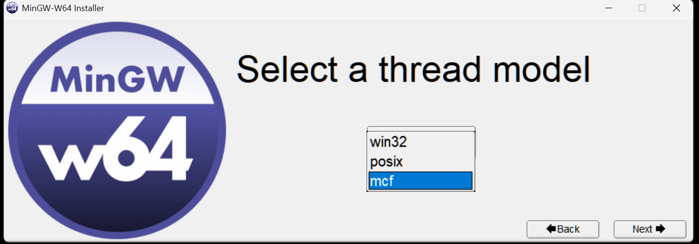

-------------------------------------------------------

Explicación comparativa de esta parte de las opciones:

-------------------------------------------------------

### **win32**

- Implementa los hilos usando directamente la API de Windows (CreateThread, CRITICAL_SECTION, etc).

- Rápido, pero no soporta 100% las funciones de POSIX Threads.

- Algunas librerías que esperan pthread completo no funcionan bien.

### **posix**

- Emula la API de pthreads sobre Windows, usando win32 por debajo.

- Da más compatibilidad con librerías pensadas para Linux.

- Un poco más pesado porque es una capa extra.

### **mcf** (Minimal C Framework threads) <--

- Es un runtime más nuevo/experimental, diseñado para ser más limpio y ligero que win32 o posix.

- Tiene mejor soporte moderno para C++11/14/17 threads.

- Muchos proyectos (p. ej. Hugo → que depende de libsass y libwebp con hilos) funcionan más estable con mcf que con win32/posix.

- *No está siempre en todos los builds, por eso poco se conoce.

### 4. Seleccionar build liberada:

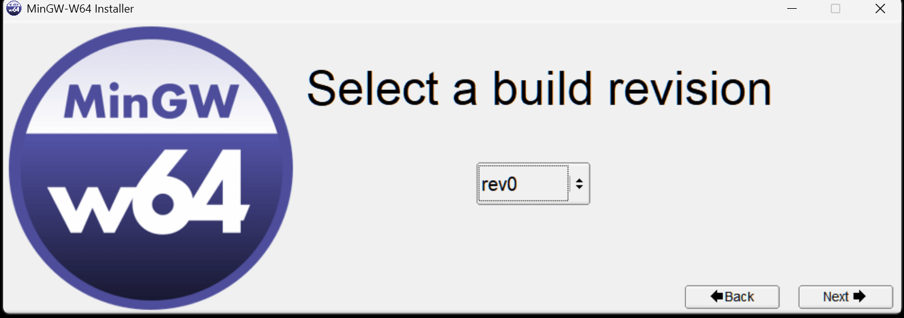

### 5. Seleccionar runtime universal:

- Opción única por defecto.

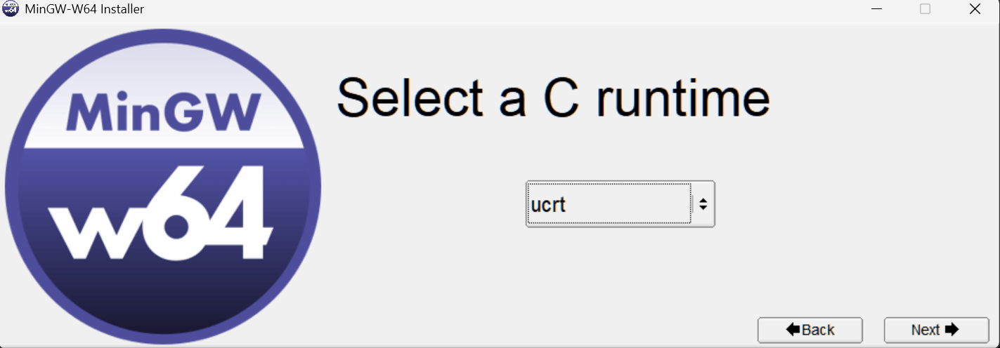

### 6. Seleccionar ubicación para guardar descarga e instalación:

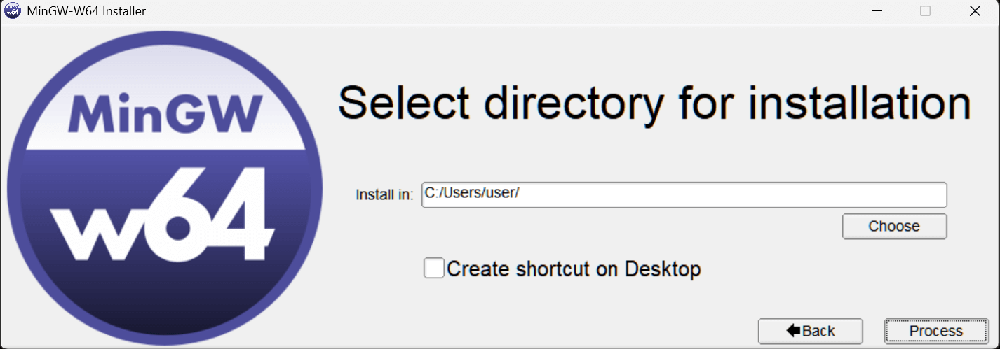

- Se puede elegir "Mi computadora" que ubica en la unidad de sistema y aplicaciones. Ahi creara su propia carpeta nombrada **mingw64**.

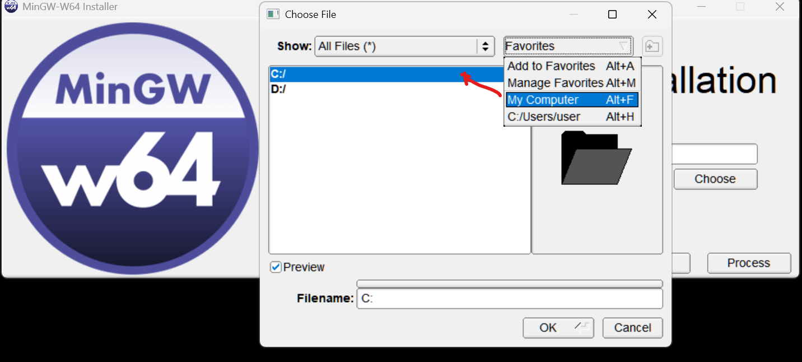

Confirmando la ubicación lo último a hacer en el instalador en linea es darle "Proceder" y realizara todo lo necesario con las opciones elegidas.

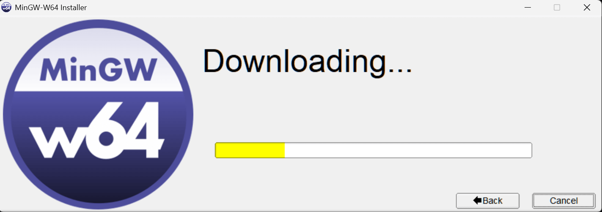

## Pasos post instalación:**

1. Confirmar agregar la ubicación de **MinGW-w64** en el PATH de sistema en la variables de entorno.

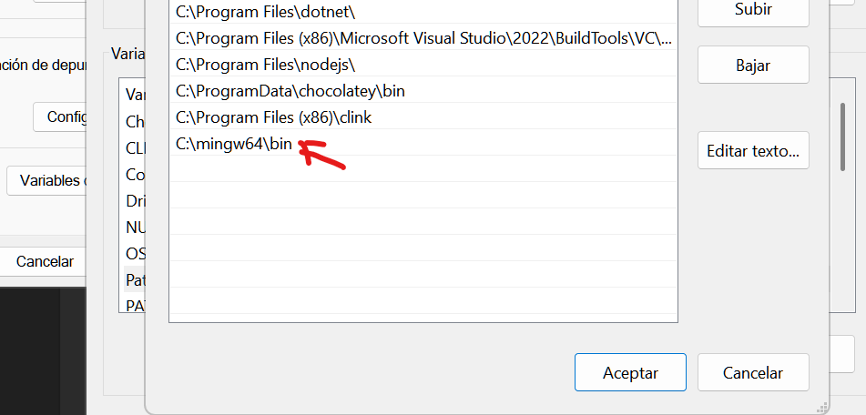

2. Modificar CGO_ENABLED si la instalación de **MinGW-w64** se hizo posterior al SDK de Go o si no se modifico. Usar: **`go env -w CGO_ENABLED=1`** para que se escriba el cambio en **%appdata%/go/env** y se lea como el valor de entorno.

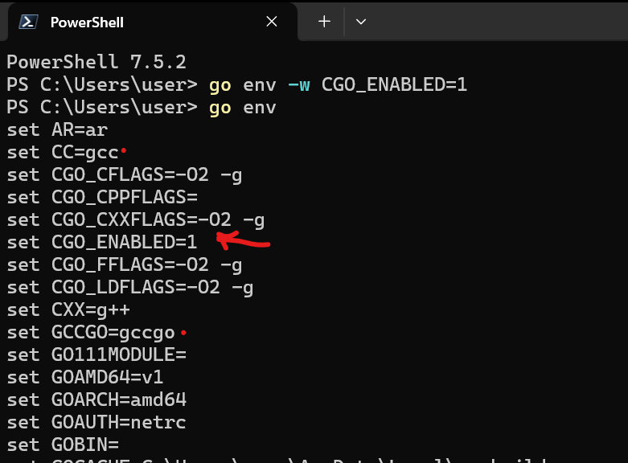

----------------------------------------------------------------------------------------------------------

Al final esta forma crea un acceso de ventana de terminal con el entorno integrado de C usando MinGW-w64 GCC.

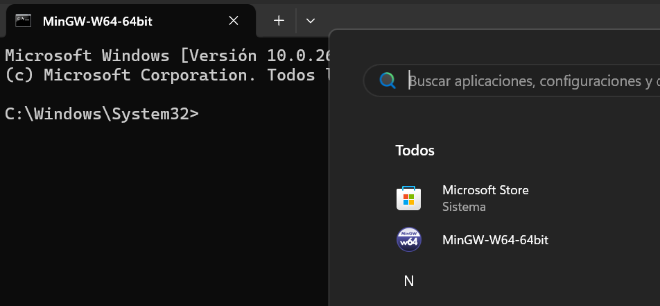