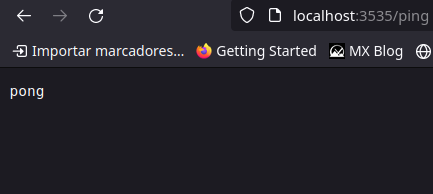



La potencia y simplicidad de Go lo hacen un candidato ideal para elegirlo cómo herramienta para programar servicios cómo Apis REST.

En esta serie de Codelabs construiremos una api rest conectando una base de datos MySQL con nuestro lenguaje favorito.

<!--more-->


Esta serie se compone de los siguientes artículos que se irán publicando progresivamente.

* Codelab 1. Configuración de la aplicación, router, repositorio para acceder a datos y primer endpoint.
* [Codelab 2](/posts/2024/02/codelab.-implementemos-una-api-rest-con-go-2/). Testeando enpoints. Simulando una petición http.
* Codelab 3. Implementando endpoint con filtrado.
* Codelab 4. Implementando endpoint para actualizar una entidad.
* Codelab 5. Refactorizando. Reemplazando nuestro router por una librería.

---
Se preguntará porqué usamos la imagen de un zorro en artículo sobre apis REST, y la razón es que *the artic fox is RESTing* 
---
---


## Requerimientos

Para esta serie de codelabs instalaremos algunas herramientas y dependencias usando contenedores [docker](https://www.docker.com/get-started/), por lo que debe tener instalado dicho software.

Para obtener el máximo provecho de estos codelabs, Ud. debe dominar el contenido presentado en el [Go Database Tutorial](http://go-database-sql.org/index.html), y por supuesto haber completado y entendido el [Tour de Go](https://go.dev/tour/welcome/1)

## Preliminares

Asumiremos que estamos trabajando en Linux, usando la distribución Debian. si ud. usa otra distro u otro sistema operativo, por favor busque y use los comandos equivalentes para su sistema. Por ejemplo, en Windows puede usar [WSL2](https://learn.microsoft.com/es-es/windows/wsl/install)

Al ser estos artículos una serie de codelabs, en formato workshop, el contenido presentado será eminentemente práctico, por lo que dejaremos de lado la teoría, asumiendo que se tiene el bagaje de conocimientos necesario para ello.

Si bien intentaremos aplicar buenas prácticas de desarrollo, llevadas al extremo, estás terminan siendo solo *opiniones*. Si no están respaldadas por un número, las opiniones por muy bien intencionadas que sean son solo eso, opiniones en donde entran en juego el gusto y el estilo personal ¡Siéntase libre de experimentar y adecuar el código a su gusto y estilo personal!


Al construir la primera iteración de nuestra api preferimos no usar librerías ni frameworks de terceros hasta donde sea posible, para demostrar el poder de la librería estándar de Go y para entender cómo es que funcionan estas cosas. 

### Que construiremos

Construiremos una simple **api REST** con conexión a una base de datos MySQL capaz de operar sobre los datos de la tabla *actor* de la base de datos demo *Sakila*.

Escribiremos un rústico **router** para nuestra api, el cual  estará basado en las funcionalidades prestadas por el paquete `net/http`.

Implementaremos un **Logger** para mostrar información del proceso de nuestra api que además usaremos para imprimir por consola las consultas SQL que realicemos.

Encapsularemos la conexión a base de datos en su propio paquete e implementaremos algunas cosas sofisticadas cómo una conexión **mock** para simular el acceso a base datos y poder construir pruebas sin depender de ella.

Prepararemos nuestra api para que pueda ser ejecutada en modo simulación, funcionando sin conectar realmente con la base de datos.

Presentaremos una forma sencilla de manejar configuraciones de la aplicación y cómo modificar su comportamiento con flags de línea de comandos, sin usar librerías externas.

Implementaremos un [repositorio](https://www.umlboard.com/design-patterns/repository.html) para separar la lógica de la aplicación del acceso a datos.

El binario ejecutable de nuestra api será capaz de recibir y procesar *flags* que modifiquen su comportamiento.

En principio, los flags que usaremos serán:

* **Env**   cuyo valor podrá ser *development* o *production*, para indicar el ambiente en que se ejecutará nuestra api. Por defecto su valor será *development*

* **Debug** que indicará si nuestra aplicación se ejecutará en modo depuración lo que la llevará a loguear más información en la consola

* **Port** que indicará el puerto donde nuestra api escuchará peticiones.

* **Mock** indicará si la conexión a base de datos se debe simular

Y la forma de usarlos será:

```bash
$ nuestra_api [--env=<development|production>] [--debug] [--mock] [--port=<número>]
```

Además, obtendremos las credenciales y secretos de nuestra aplicación desde variables de entorno que cargaremos al iniciar nuestra api.

## Nuestra base de datos

Para no complicarnos, usaremos la base de datos de demostración de MySQL, la base de datos [Sakila](https://dev.mysql.com/doc/sakila/en/). La instalaremos y le daremos uso a través de un contenedor docker. Puede acceder al repositorio con la información de la imagen precargada de Sakila en este [enlace](https://github.com/sakiladb/mysql9).

Si tiene docker instalado, puede ejecutar este contenedor con el siguiente comando

```bash
$ docker run -p 3306:3306 -d sakiladb/mysql:latest
```

El cual descargará la imagen. Si aún no tiene instalado docker, revise [las instrucciones para instalarlo en su sistema](https://docs.docker.com/get-docker/) y después continúe con el codelab.

Una vez que el contenedor se encuentre en ejecución, podrá acceder a la base de datos Sakila usando su cliente MySQL favorito. Las credenciales son: usuario *sakila*, clave *p_ssW0rd*, base de datos *sakila*.

Nosotros nos conectaremos a través de la línea de comandos usando el cliente mysql.

```bash
$ mysql --host=127.0.0.1 --port=3306 --user=sakila  --password=p_ssW0rd sakila

MySQL [sakila]> SHOW TABLES;
+----------------------------+
| Tables_in_sakila           |
+----------------------------+
| actor                      |
| actor_info                 |
| address                    |
| category                   |
| city                       |
| country                    |
| customer                   |
| customer_list              |
| film                       |
| film_actor                 |
| film_category              |
| film_list                  |
| film_text                  |
| inventory                  |
| language                   |
| nicer_but_slower_film_list |
| payment                    |
| rental                     |
| sales_by_film_category     |
| sales_by_store             |
| staff                      |
| staff_list                 |
| store                      |
+----------------------------+
23 rows in set (0.005 sec)

MySQL [sakila]> SELECT * FROM actor LIMIT 5;
+----------+------------+--------------+---------------------+
| actor_id | first_name | last_name    | last_update         |
+----------+------------+--------------+---------------------+
|        1 | PENELOPE   | GUINESS      | 2006-02-15 04:34:33 |
|        2 | NICK       | WAHLBERG     | 2006-02-15 04:34:33 |
|        3 | ED         | CHASE        | 2006-02-15 04:34:33 |
|        4 | JENNIFER   | DAVIS        | 2006-02-15 04:34:33 |
|        5 | JOHNNY     | LOLLOBRIGIDA | 2006-02-15 04:34:33 |
+----------+------------+--------------+---------------------+
5 rows in set (0.002 sec)
```

## Estructura de directorios

Organizaremos nuestra api de la siguiente forma.

```
.
├── api
│   └── v1
├── config
├── db
├── go.mod
├── go.sum
├── internal
├── logadapter
└── main.go
```

Si ha tenido experiencia con Go, notará que obviamos el directorio `pkg`. Lo cual es una preferencia personal basada en esta [discusión](https://github.com/golang-standards/project-layout/issues/10).

Para preparar esta estructura, en algún lugar de su disco, cree los directorios indicados.

```bash
$ go mod init rest_api_example

$ mkdir internal
$ mkdir logadapter
$ mkdir db
$ mkdir config
$ mkdir api/v1 -p

$ touch main.go
```

---

## Instalando dependencias

Para la primera iteración de nuestra api, requerimos solo 3 dependencias que instalaremos en el directorio raíz de nuestro módulo.

### [Driver Mysql](https://github.com/go-sql-driver/mysql)

Necesitamos el driver que implementa las interfaces del paquete `database/sql`.

```bash
$ go get github.com/go-sql-driver/mysql
```

### [Sql Logger](https://github.com/simukti/sqldb-logger)

Implementa la visualización de las consultas sql por consola usando un adaptador sobre algún elemento que implemente la interface común de un [Logger](https://pkg.go.dev/log).

```bash
$ go get github.com/simukti/sqldb-logger
```

### [Godotenv](https://github.com/joho/godotenv). Parseador de archivos .env

Usaremos cómo dependencia una utilidad para la carga de variables de entorno guardadas en archivos .env, pues, cómo se dijo antes, obtendremos desde variables de entorno información para el funcionamiento de nuestra aplicación.

```bash
$ go get github.com/joho/godotenv
```

---

## Codificando nuestra api


### Configuraciones

Empecemos por preparar una estructura de datos capaz de contener la información que nuestra aplicación recibirá desde los flags de consola.

Cree el archivo *config.go* en el directorio *config* y escriba en él este código.

```go
var cfg = newDefault()

// Config contiene la información de configuración de nuestra aplicación
type Config struct {
    // Env indica el modo en que se ejecuta nuestra api. Valores válidos son development|production
	Env   string

    // Debug indica si nuestra app se ejecuta en modo depuración, lo que la hará escribir más info en logs de consola
	Debug bool

    // Port indica el puerto donde nuestra app estará escuchando.
	Port  int
}

// newDefault devuelve una instancia de [Config] cargada con los valores de configuración por defecto
func newDefault() *Config {
	return &Config{
		Env:   "development",
		Debug: false,
		Port:  3000,
	}
}
```

cómo las configuraciones de la aplicación se cargan una sola vez, y después de eso no varían (¡Generalmente!) podemos aplicar una forma muy simplificada del patrón [Singleton](https://refactoring.guru/es/design-patterns/singleton) y tener una única instancia de las configuraciones para toda nuestra api, aprovechando la encapsulación a nivel de paquete que nos provee Go (Recordemos que en Go la [unidad de encapsulación es el paquete](https://www.geeksforgeeks.org/encapsulation-in-golang/)) 

Ahora, debemos crear una función que sea capaz de cargar las configuraciones desde los flags con que se ejecute nuestra aplicación.

Esto lo haremos usando el paquete [`flag`](https://pkg.go.dev/flag) de la librería estándar que implementa el procesamiento de flags modificadores desde la línea de comandos.

Las funcionalidades de este paquete nos permite definir los modificadores de línea de comando, su tipo y su valor por defecto, indicándolas expresamente al momento de definirlo. Por ejemplo 

```go
env := flag.String("env", "development", "environment")
```

guardará en la variable `env` durante la ejecución del programa el valor asociado al flag *--env*, si es que se asigna, o por defecto el valor *development* si no se usará el flag.

```go
// LoadCliConfig parsea los flags usados al ejecutar la api para cargar su info en la estructura de datos de configuraciones
func LoadCliConfig() {

    // Definimos 3 posibles flags para nuesta app
	env := flag.String("env", "development", "environment")
	debug := flag.Bool("debug", false, "debug mode")
	port := flag.Int("port", -1, "port where to listen")

	flag.Parse()

    // Verificamos si se agregaron flags en cuyo caso sobreescribimos los valores por defecto.
	// En caso de haberse pasado un environment inválido, se mantiene el valor por defecto
	if *env == "production" || *env == "development" {
		cfg.Env = *env
	}

	if debug != nil {
		cfg.Debug = *debug
	}

	if *port > -1 {
		cfg.Port = *port
	}
}
```

Finalmente, agregamos algunas funciones de utilidad para acceder directamente a las configuraciones sin tener que pasar por la variable `cfg`.

```go
func Environment() string {
	return cfg.Env
}

func Debug() bool {
	return cfg.Debug
}

func Port() int {
	return cfg.Port
}
```


### Logging

Construiremos ahora una implementación de la interface log para poder imprimir en consola información del flujo de nuestra aplicación.

Cree el archivo *logadapter/simple_logger_adapter.go* e ingrésele el siguiente código

```go
package logadapter

import (
	"context"
	"log"
	"os"

	sqldblogger "github.com/simukti/sqldb-logger"
)

var Log Logger = Logger{log.New(os.Stdout, "", log.LstdFlags)}

type Logger struct {
	*log.Logger
}

func (l *Logger) Debug(args ...interface{}) {
	l.Logger.Println(args...)
}

func (l *Logger) Info(args ...interface{}) {
	l.Logger.Println(args...)
}

func (l *Logger) Warn(args ...interface{}) {
	l.Logger.Println(args...)
}

func (l *Logger) Error(args ...interface{}) {
	l.Logger.Println(args...)
}

func (l *Logger) Fatal(args ...interface{}) {
	l.Logger.Println(args...)
	os.Exit(1)
}

func (l *Logger) Panic(args ...interface{}) {
	panic(args)
}

func (l *Logger) Log(_ context.Context, level sqldblogger.Level, msg string, data map[string]interface{}) {

	switch level {
	case sqldblogger.LevelError:
		l.Error(msg)
	case sqldblogger.LevelInfo:
		l.Info(msg)
	case sqldblogger.LevelDebug:
		l.Debug(msg)
	case sqldblogger.LevelTrace:
		l.Trace(msg)
	default:
		l.Error(msg)
	}

}

func (l *Logger) Debugf(format string, args ...interface{}) {
	l.Logger.Printf(format, args...)
}

func (l *Logger) Infof(format string, args ...interface{}) {
	l.Logger.Printf(format, args...)
}

func (l *Logger) Warnf(format string, args ...interface{}) {
	l.Logger.Printf(format, args...)
}

func (l *Logger) Errorf(format string, args ...interface{}) {
	l.Logger.Printf(format, args...)
}

func (l *Logger) Trace(format string, args ...interface{}) {
	l.Logger.Println(args...)
}

func (l *Logger) Tracef(format string, args ...interface{}) {
	l.Logger.Printf(format, args...)
}

func (l *Logger) Fatalf(format string, args ...interface{}) {
	l.Logger.Printf(format, args...)
	os.Exit(1)
}

func (l *Logger) Panicf(format string, args ...interface{}) {
	panic(args)
}

func NewSimpleLogger() *Logger {
	return &Logger{log.New(os.Stdout, "", log.LstdFlags)}
}


// SimpleLoggerAdapter es un adaptador que se compone de [Logger]. Es solicitado por [sqldb-logger]
// para poder loguear las consultas
type SimpleLoggerAdapter struct {
	Logger *Logger
}

func NewSimpleAdapter(logger *SimpleLoggerAdapter) sqldblogger.Logger {
	return NewSimpleLogger()
}

```

No nos detendremos mucho en este archivo pues solo expone varios métodos para imprimir información en consola. Es también una simple implementación de *Singleton* para usar la misma instancia del logger a lo largo de nuestra aplicación. Debido a su sencillez, todos sus métodos derivan en `Println` o `Printf`.

`SimpleLoggerAdapter` es un adaptador solicitado por *sqldb-logger* para poder imprimir las consultas SQL.


## Conexión a base de datos

Encapsulamos los medios de conexión y acceso a datos en su propio paquete, en el directorio *db*. Otra vez aplicaremos *Singleton* y mantendremos un único [pool de conexiones](http://go-database-sql.org/connection-pool.html) que le dará servicio a nuestra aplicación.

Cree el archivo *db.go* e ingrése el siguiente código.


```go
// db singleton manteniendo el pool de conexiones de nuestra aplicación
var db *sql.DB

// QueryAble representa algo capaz de ejecutar consultas contra base de datos
type QueryAble interface {
	Exec(query string, args ...interface{}) (sql.Result, error)
	ExecContext(ctx context.Context, query string, args ...interface{}) (sql.Result, error)
	Prepare(query string) (*sql.Stmt, error)
	Query(query string, args ...interface{}) (*sql.Rows, error)
	QueryRow(query string, args ...interface{}) *sql.Row
	QueryContext(ctx context.Context, query string, args ...interface{}) (*sql.Rows, error)
	QueryRowContext(ctx context.Context, query string, args ...interface{}) *sql.Row
}

// Open inicializa el pool de conexiones en el singleton e intenta hacer ping a la BD.
// Si debug es true, se carga en pool de conexiones un adaptador para loguear las consultas a consola
// cómo se explica en https://github.com/simukti/sqldb-logger?tab=readme-ov-file
func Open(dsn string, debug bool) (err error) {

	if db, err = sql.Open("mysql", dsn); err != nil {
		return
	}

    // Si la api se levanta con el flag --debug
	// se inicializará en modo depuración, que imprime las consultas
	// a BD.
	// Por eso verificamos al parámetro debug en este punto, en caso
	// de ser verdadero cargamos al adaptador del log para imprimir las
	// consultas.
	if debug {

		loggerAdapter := logadapter.NewSimpleAdapter(&logadapter.SimpleLoggerAdapter{
			Logger: &logadapter.Logger{},
		})

		db = sqldblogger.OpenDriver(dsn, db.Driver(), loggerAdapter) // db sigue siendo *sql.DB
	}

	if err = db.Ping(); err != nil {
		return
	}

	return
}

func Close() error {
	return db.Close()
}

func Begin() (*sql.Tx, error) {
	return db.Begin()
}

func Rollback(tx *sql.Tx) error {
	return tx.Rollback()
}

func Commit(tx *sql.Tx) error {
	return tx.Commit()
}

```

Exponemos también algunas utilidades para abrir y cerrar [transacciones](https://www.mysqltutorial.org/mysql-stored-procedure/mysql-transactions/).


### Nuestro primer handler

Un handler es un elemento capaz de procesar peticiones http. Se registran junto con la ruta del endpoint que deben servir. Podemos usar funciones o structs como handlers, dependiendo si al registrarlas usamos `ServeMux.Handle` o `ServeMux.HandleFunc`

En el directorio *api/v1/handler* cree al archivo *ping.go* y agréguele el siguiente código.

```go
package handler

import "net/http"

type PingHandler struct{}

func (p *PingHandler) ServeHTTP(w http.ResponseWriter, r *http.Request) {
	// El método Write devuelve la cantidad de bytes escritos en el buffer de destino y el posible error de escritura
	// Para mantener la simplicidad del ejercicio, descartamos esos datos.
	_, _ = w.Write([]byte("pong"))
}

```

El handler no es más que un struct que implementa la interface `http.Handler`, debido a que registraremos la ruta del endpoint que será manejado por él con el método [*ServeMux.Handler](https://pkg.go.dev/net/http#ServeMux.HandleFunc)

```go
// No agregue esto al código, es solo para mostrar que es lo que PingHandler está implementando
type Handler interface {
	ServeHTTP(ResponseWriter, *Request)
}
```


### Levantando nuestra api

¡Ya casi completamos esta etapa! Por el momento debemos  preparar el alzamiento de nuestra api en el archivo *main.go*

```go
package main

import (
	"fmt"
	"net/http"
	"os"
	"restexample/api/v1/handler"
	"restexample/config"
	"restexample/db"
	"restexample/logadapter"

	"github.com/joho/godotenv"
)

func main() {

	boot()

    // deferimos el cierre del singleton de conexiones al término de la ejecución de la aplicación
    // recordemos que la conexión se abrió dentro de la función boot
	defer db.Close() // Este db es el paquete db de nuestra aplicación

    // inicializamos al router
	mux := http.NewServeMux()

    // registramos un handler para el endpoint /ping
	mux.Handle("/ping", &handler.PingHandler{})

	prt := fmt.Sprintf(":%d", config.Port())

	logadapter.Log.Infof("Starting mode %s server on %s", config.Environment(), prt)

	// Ponemos nuestra api a escuchar peticiones
	logadapter.Log.Panic((http.ListenAndServe(prt, mux)))
}

// boot es responsable de cargar las variables de entorno y de parsear los flags que se le agregan a nuestra aplicación.
// Verifica que el ambiente indicado en los flags sea uno válido
func boot() {

	// Cargaremos con godotenv como las variables de entorno la información
	// registrada en el archivo .env 
	// En este ejercicio descartamos el error 
	// pero ¡Recuerde que en producción todo 
	// error debe ser validado!
	_ = godotenv.Load()

	config.LoadCliConfig()

    // dependiendo del ambiente seleccionado se carga el dsn adecuado desde la variable de entorno que corresponda
	if config.Environment() == "development" {

		err := db.Open(os.Getenv("DEV_API_DB_DSN"), config.Debug())

		if err != nil {
			logadapter.Log.Fatal("Couldnt open database")
		}

	} else if config.Environment() == "production" {

		err := db.Open(os.Getenv("PROD_API_DB_DSN"), config.Debug())

		if err != nil {
			logadapter.Log.Fatal("Couldnt open database")
		}
	} else {
		logadapter.Log.Fatal("Invalid environment")
	}
}

```

Para no tener que exportar las variables de entorno, crearemos en la raíz del repositorio un archivo  *.env* donde guardemos esa información. Este será leído y procesado dentro de la función `boot` por *godotenv*, el cual inyectará esa información para que esté disponible a través de `os.Getenv`

```.env
DEV_API_DB_DSN=sakila:p_ssW0rd@tcp(127.0.0.1:3306)/sakila?parseTime=true

PROD_API_DB_DSN=sakila:p_ssW0rd@tcp(127.0.0.1:3306)/sakila?parseTime=true
```

Para este codelab, usaremos la misma información tanto para desarrollo cómo para producción, pues la intención es *mostrar una forma válida de separar ambientes*. En una aplicación del mundo real, **cada ambiente debería tener su propia información**.

## Probemos nuestra iteración

Levantemos nuestra api.

```bash
$ go run main.go --port=3535 --env=production
2024/02/09 17:15:19 Starting mode production server on :3535
```

Si revisamos el endpoint `/ping` deberíamos ver algo cómo lo siguiente



¡Nuestra api vive!

## Refactoricemos y agreguemos nuestro primer modelo.

Si bien ya podemos levantar nuestra api y dar uso al endpoint de pruebas ping, aun no hacemos uso de la conexión a base de datos para obtenerlos.

### Habilitando una conexión mock. Preparando el modo simulación.

Habilitaremos una conexión mock para simular la conexión a base de datos y poder hacer pruebas sin depender de ella. Para hacerlo debemos realizar unas pocas modificaciones.

Cambiemos el archivo *config/config.go* para que nuestra aplicación soporte levantarse en modo simulación. Asegúrese de modificar el archivo para que contenga el siguiente snippet de código

```go
package config

import "flag"

var cfg = newDefault()

type Config struct {
	Env   string
	Debug bool
	Mock  bool   // Nuevo campo del struct!
	Port  int
}

func newDefault() *Config {
	return &Config{
		Env:   "development",
		Debug: false,
		Mock:  false,    // Nuevo valor por defecto!
		Port:  3000,
	}
}


// LoadCliConfig carga la configuración desde los flags modificadores de línea de comando
func LoadCliConfig() {
	env := flag.String("env", "development", "environment")
	debug := flag.Bool("debug", false, "debug mode")
	mock := flag.Bool("mock", false, "mock database connection")   // Nueva inicialización del campo
	port := flag.Int("port", -1, "port where to listen")

	flag.Parse()

	if env != nil && (*env == "production" || *env == "development") {
		cfg.Env = *env
	}

	cfg.Debug = *debug
	cfg.Mock = *mock

	if *port > -1 {
		cfg.Port = *port
	}
}

func Environment() string {
	return cfg.Env
}

func Debug() bool {
	return cfg.Debug
}

func Port() int {
	return cfg.Port
}

func Mock() bool {    // Nueva función para exponer la configuración
	return cfg.Mock
}


```


Luego, modifiquemos el archivo *db/db.go*

```go
package db

import (
	"context"
	"database/sql"
	"errors"
	"restexample/logadapter"

	sqldblogger "github.com/simukti/sqldb-logger"

	_ "github.com/go-sql-driver/mysql"
)

type QueryAble interface {
	Exec(query string, args ...interface{}) (sql.Result, error)
	ExecContext(ctx context.Context, query string, args ...interface{}) (sql.Result, error)
	Prepare(query string) (*sql.Stmt, error)
	Query(query string, args ...interface{}) (*sql.Rows, error)
	QueryRow(query string, args ...interface{}) *sql.Row
	QueryContext(ctx context.Context, query string, args ...interface{}) (*sql.Rows, error)
	QueryRowContext(ctx context.Context, query string, args ...interface{}) *sql.Row
}

var db *sql.DB

func Open(dsn string, debug bool, mock bool) (err error) { // agregamos un nuevo parámetro para indicar si la conexión es mock

    // si la conexión solicitada es para hacer mock, terminamos sin conectar a una BD verdadera, 
    // pero sin terminar con error, para que la aplicación pueda continuar.
	// Esto significa que la variable db tendrá el valor nil por todo el tiempo 
	// de vida de la aplicación, no nos causará problemas porque cuando esté activo el modo
	// simulación, se usará el proveedor de datos mock	
	if mock {
		return
	}

	if db, err = sql.Open("mysql", dsn); err != nil {
		return
	}

	if debug {
		loggerAdapter := logadapter.NewSimpleAdapter(&logadapter.SimpleLoggerAdapter{
			Logger: &logadapter.Logger{},
		})
		db = sqldblogger.OpenDriver(dsn, db.Driver(), loggerAdapter /*, using_default_options*/) // db is STILL *sql.DB
	}

	if err = db.Ping(); err != nil {
		return
	}

	return
}

func DB() *sql.DB {
	return db
}

func Close() error {
	return db.Close()
}

func Begin() (*sql.Tx, error) {
	return db.Begin()
}

func Rollback(tx *sql.Tx) error {
	return tx.Rollback()
}

func Commit(tx *sql.Tx) error {
	return tx.Commit()
}

var (
	ErrNoConnection = errors.New("expected a db connection or a transaction. Nil received")
)

```


Implementaremos el patrón [repository](https://www.umlboard.com/design-patterns/repository.html), para separar la lógica del negocio de los aspectos del acceso a datos. El uso práctico que le daremos a este patrón es la creación de una implementación alternativa que usaremos para simular la conexión y así poder realizar tests que no dependan de la conexión física a la base de datos. Es decir, implementaremos un proveedor de datos de simulación.

Construiremos cuatro estructuras de datos.

* Una *interface* que será nuestro repositorio específico para la entidad. Representará algo capaz de realizar operaciones sobre ella. Le llamaremos `IActor` para diferenciarla de las demás estructuras de datos. 

* Un struct `Actor` que usaremos para almacenar los datos de la entidad

* Un struct `ActorCrud` que implementa al repositorio y posee métodos para operar sobre la entidad usando la conexión a base de datos provista en el parámetro `db.QueryAble`

* Un struct `MockActorCrud` que también posee métodos para operar sobre la entidad implementando al repositorio, pero que simula la conexión a BD.

Tenga presente que los nombres que hemos usado para denominar a nuestra estructuras de datos son arbitrarios y no obedecen a recomendación alguna, esto para mantener la simplicidad del ejercicio. De hecho, muchos programadores prefieren mantener las interfaces de sus repositorios en su propio paquete, separándolas de la implementación.

Es **opinión personal** de quien escribe, que eso solo agrega complejidad ¡Pero a gustos colores!

En el directorio *db*, cree al subdirectorio *model*, y dentro de él al archivo *actor.go* al cual ingrésele el siguiente código.

```go
package model

import (
	"restexample/db"
	"time"
)

// IActor representa una cosa con la capacidad de operar sobre la entidad actor
type IActor interface {

	// Get obtiene un actor por su id
	Get(db.QueryAble, int64) (Actor, error)

	// Los siguientes métodos están comentados porque aun no los implementaremos
	// Fetch(QueryAble, ActorFilter) ([]Actor, error)
	// Save(QueryAble, *Actor) error
}

// Actor mantiene los datos de una entidad actor
type Actor struct {
	ID         int64     `json:"id"`         // actor_id
	FirstName  string    `json:"firstName"`  // first_name
	LastName   string    `json:"lastName"`   // last_name
	LastUpdate time.Time `json:"lastUpdate"` // last_update
}

var _ IActor = ActorCrud{}

// ActorCrud encapsula métodos capaces de operar sobre la entidad actor. Implementa a IActor
type ActorCrud struct{}

// Get recupera un actor por su id
func (a ActorCrud) Get(q db.QueryAble, ID int64) (actor Actor, err error) {

	// Si no se ha inicializado la conexión, devuelve ErrNoConection
	if q == nil {
		err = db.ErrNoConnection
		return
	}

	err = q.QueryRow(sqlGetActorByID, ID).Scan(
		&actor.ID,
		&actor.FirstName,
		&actor.LastName,
		&actor.LastUpdate,
	)

	return
}

var _ IActor = MockActorCrud{}

// MockActorCrud encapsula métodos para operar sobre la entidad actor simulando una conexión. Implementa a IActor
type MockActorCrud struct{}

// Get recupera un actor por su id
func (a MockActorCrud) Get(q db.QueryAble, ID int64) (actor Actor, err error) {
	// cómo MockActorCrud solo simula la conexión, la obligamos a devolver datos de actor en duro
	// para simular la obtención de una entidad actor
	actor.ID = ID
	actor.FirstName = "Pepito"
	actor.LastName = "Grillo"
	actor.LastUpdate, _ = time.Parse("Jan 2, 2006 at 3:04pm (MST)", "Feb 4, 2014 at 6:05pm (PST)")
	return
}

// NewActorCrud retorna algo que implementa a IActor.
// Si mock es true, retornara una instancia de MockActorCrud
// para simular la conexión.
func NewActorCrud(mock bool) IActor {
	if mock {
		return MockActorCrud{}
	}

	return ActorCrud{}
}

const (

	sqlGetActorByID     = `SELECT actor_id, first_name, last_name, last_update FROM actor WHERE actor_id = ?`
)


```

Observe que hemos construido la función `NewActorCrud` que según si su argumento es verdadero o falso, devolverá una instancia de `ActorCrud` o de `MockActorCrud` para simular o no la conexión a DB.

Construyamos un test para probar nuestro repositorio. Lo que probaremos en esta ocasión será la implementación mock.

En el archivo *db/model/actor_test.go* agregue el siguiente código.

```go
package model

import (
	"os"
	"restexample/db"
	"testing"

	"github.com/joho/godotenv"
)

func TestActorGetMock(t *testing.T) {

    // Abrimos una conexión mock a base de datos, cómo lo indica el 3° argumento
	err := db.Open(os.Getenv("DEV_API_DB_DSN"), config.DEBUG_MODE, config.USE_MOCK_CONNECTION) // <- el segundo true es para indicar que se trata de una conexión mock

	if err != nil {
		t.Log(err)
		t.FailNow()
	}

	var actorCrud = MockActorCrud{}

	actorInfo, err := actorCrud.Get(db.DB(), 1)

	if err != nil {
		t.Log(err)
		t.FailNow()
	}

	if actorInfo.ID != 1 {
		t.Log("actor id is not 1")
		t.FailNow()
	}

	if actorInfo.FirstName != "Pepito" {
		t.Log("actor name is not Pepito")
		t.FailNow()
	}

    t.Log(actorInfo)
}


func BenchmarkActorGetMock(b *testing.B) {

	_ = godotenv.Load()
	err := db.Open(os.Getenv("DEV_API_DB_DSN"), config.DEBUG_MODE, config.USE_MOCK_CONNECTION)

	if err != nil {
		b.Log(err)
		b.FailNow()
	}

	var actorCrud = MockActorCrud{}

	b.ResetTimer()

	for i := 0; i < b.N; i++ {
		_, _ = actorCrud.Get(db.DB(), 1)
	}
}


```


Al ejecutar este test, debería ver algo cómo lo siguiente

```bash
$ go test -timeout 256s -run ^TestActorGetMock$ restexample/db/model -v
=== RUN   TestActorGet
    actor_test.go:40: {1 Pepito Grillo 2024-02-09 18:17:31.313340037 -0300 -03 m=+0.000316844}
--- PASS: TestActorGet (0.00s)
PASS
ok      restexample/db/model    0.001s
```

Al ejecutar el benchmark, verá algo similar a lo siguiente.

```bash
$ go test -benchmem -run=^$ -bench ^BenchmarkActorGetMock$ restexample/db/model

goos: linux
goarch: amd64
pkg: restexample/db/model
cpu: Intel(R) Core(TM) i7-10700 CPU @ 2.90GHz
BenchmarkActorGetMock-16    	 3183381	       366.4 ns/op	     163 B/op	       4 allocs/op
PASS
ok  	restexample/db/model	1.551s
```


¿Por qué deberíamos construir nuestros tests sobre la conexión mock? Pues porque los tests deben ser [aislados, independientes y auto validantes](https://github.com/tekguard/Principles-of-Unit-Testing), y no depender de elementos ambientales cómo los datos que residen en una base de datos específica que pueden cambiar con el tiempo.

### El handler de actores

Ahora que ya tenemos las bases en la configuración y en el acceso a datos, construyamos un handler para manejar las peticiones a actores.

Observe que en el método `ServeHTTP` hemos escrito un switch con el que ayudándonos por expresiones regulares manejamos las peticiones por las que este handler será responsable. A medida que escribamos código para manejar peticiones relativas a actores, este switch irá creciendo.

En pocas palabras, **hemos construido nuestro primer router**.


En el directorio *api/v1/handler* cree el archivo *actor.go* y agréguele el siguiente código.

```go
package handler

import (
	"database/sql"
	"encoding/json"
	"net/http"
	"regexp"
	"restexample/config"
	"restexample/db"
	"restexample/db/model"
	"restexample/logadapter"
	"strconv"
	"strings"
)

var (
    // actorRXPWithID rxp para determinar si se está haciendo una petición al endpoint /actors/{:id}
	actorRXPWithID = regexp.MustCompile(`^/actors/[0-9]+$`)
)

type ActorHandler struct{}

// ServeHTTP deriva al handler de actor correspondiente
func (a *ActorHandler) ServeHTTP(w http.ResponseWriter, r *http.Request) {

    // a este switch se le irán agregando cases para manejar los distintos endpoints que deban ser manejados por ActorHandler
	switch {
    // enpoint /actors/{:id}
	case r.Method == http.MethodGet && actorRXPWithID.MatchString(r.URL.Path):
		a.GetActorByID(w, r)
	default:
		return
	}
}


// GetActorByID maneja endpoint enpoint /actors/{:id}
func (a *ActorHandler) GetActorByID(w http.ResponseWriter, r *http.Request) {
	matches := strings.Split(r.URL.Path, "/")

	if len(matches) < 2 {
		logadapter.Log.Error("couldnt parse actor id from query param")
		response := NewActorInternalServerErrorResponse()
		js, _ := json.Marshal(response)
		w.WriteHeader(http.StatusInternalServerError)
		_, _ = w.Write(js)
		return
	}

	ID, err := strconv.ParseInt(matches[2], 10, 64)

	if err != nil {
		logadapter.Log.Error("couldnt parse actor id as integer value")
		response := NewActorBadRequestResponse()
		js, _ := json.Marshal(response)
		w.WriteHeader(http.StatusInternalServerError)
		_, _ = w.Write(js)
		return
	}

	actorRepo := model.NewActorCrud(config.Mock())

	actor, err := actorRepo.Get(db.DB(), ID)

	if err != nil {
		if err == sql.ErrNoRows {
			logadapter.Log.Error("actor id not found")
			response := NewActorNotFoundResponse()
			js, _ := json.Marshal(response)
			w.WriteHeader(http.StatusInternalServerError)
			_, _ = w.Write(js)
			return
		}

		logadapter.Log.Error("couldnt get actor by id, something was wrong")
		response := NewActorBadRequestResponse()
		js, _ := json.Marshal(response)
		w.WriteHeader(http.StatusInternalServerError)
		_, _ = w.Write(js)
		return
	}

	response := NewActorResponse(actor)
	js, _ := json.Marshal(response)
	w.WriteHeader(http.StatusInternalServerError)
	_, _ = w.Write(js)
}


// ActorResponse contendrá la respuesta a la petición al endpoint /actors/{:id}
type ActorResponse struct {
	Status string      `json:"status"`
	Code   int         `json:"code"`
	Data   interface{} `json:"data"`
}

// NewActorResponse devuelve una respuesta a la petición al endpoint /actors/{:id} exitosa
func NewActorResponse(data interface{}) ActorResponse {
	return ActorResponse{
		Status: "ok",
		Code:   200,
		Data:   data,
	}
}

// NewActorResponse devuelve una respuesta a la petición al endpoint /actors/{:id} fallida por id no encontrado
func NewActorNotFoundResponse() ActorResponse {
	return ActorResponse{
		Status: "fail",
		Code:   404,
		Data:   make(map[string]interface{}, 0),
	}
}

// NewActorResponse devuelve una respuesta a la petición al endpoint /actors/{:id} fallida por bad request
func NewActorBadRequestResponse() ActorResponse {
	return ActorResponse{
		Status: "fail",
		Code:   400,
		Data:   make(map[string]interface{}, 0),
	}
}

// NewActorResponse devuelve una respuesta a la petición al endpoint /actors/{:id} fallida por internal server error
func NewActorInternalServerErrorResponse() ActorResponse {
	return ActorResponse{
		Status: "fail",
		Code:   500,
		Data:   make(map[string]interface{}, 0),
	}
}
```


## Probando nuestro flamante endpoint

Bien, hemos implementado el flujo completo para nuestro primer endpoint, `GET /actors/{:id}`. El cual debe obtener los datos de un actor y desplegarlos en una respuesta con la siguiente estructura:

```
{
  "status": string,
  "code": int,
  "data": {
    "id": int,
    "firstName": string,
    "lastName": string,
    "lastUpdate": string // una fecha codificada como string
  }
}
```

Ahora que todas las piezas están en su sitio, probemos nuestro nuevo endpoint. Levantemos nuestra api con la conexión real a la base de datos.


```bash
go run main.go --port=3535 --env=development  --debug
2024/02/09 20:21:46 Connect
2024/02/09 20:21:46 Ping
2024/02/09 20:21:46 Starting mode development server on :3535
```

Usemos curl para realizar una petición a `GET /actors/{:id}`

```bash
curl 'http://localhost:3535/actors/12' | jq
  % Total    % Received % Xferd  Average Speed   Time    Time     Time  Current
                                 Dload  Upload   Total   Spent    Left  Speed
100   117  100   117    0     0  48467      0 --:--:-- --:--:-- --:--:-- 58500
{
  "status": "ok",
  "code": 200,
  "data": {
    "id": 12,
    "firstName": "KARL",
    "lastName": "BERRY",
    "lastUpdate": "2006-02-15T04:34:33Z"
  }
}
```

Forcemos una respuesta con código 404 enviando un id inexistente

```bash
$ curl 'http://localhost:3535/actors/120000000' | jq
  % Total    % Received % Xferd  Average Speed   Time    Time     Time  Current
                                 Dload  Upload   Total   Spent    Left  Speed
100    38  100    38    0     0  22646      0 --:--:-- --:--:-- --:--:-- 38000
{
  "status": "fail",
  "code": 404,
  "data": {}
}
```


Probemos ahora levantando nuestra api en el modo simulación de conexión a datos.

```bash
$ go run main.go --port=3535 --env=development  --debug --mock
2024/02/09 20:25:45 Starting mode development server on :3535
```

Al realizar la misma petición obtenemos el siguiente resultado.

```bash
curl 'http://localhost:3535/actors/12' | jq
  % Total    % Received % Xferd  Average Speed   Time    Time     Time  Current
                                 Dload  Upload   Total   Spent    Left  Speed
100   135  100   135    0     0   314k      0 --:--:-- --:--:-- --:--:--  131k
{
  "status": "ok",
  "code": 200,
  "data": {
    "id": 12,
    "firstName": "Pepito",
    "lastName": "Grillo",
    "lastUpdate": "2024-02-09T20:25:48.731702142-03:00"
  }
}
```

Con lo que se demuestra que nuestra pequeña api REST funciona.

Con esto ya tenemos una base para la construcción de apis REST extensible, que todavía puede mejorarse bastante. Por ejemplo en `ActorHandler`, podemos ver que hay código que se repite al momento de construir las respuestas que podría ser refactorizado en una función.

```go
logadapter.Log.Error("actor id not found")
response := NewActorNotFoundResponse()
js, _ := json.Marshal(response)
w.WriteHeader(http.StatusInternalServerError)
_, _ = w.Write(js)
```


Con eso completamos este primer workshop, dejando para el siguiente un tema de lo más apasionante, la simulación de peticiones http para testear nuestros handlers.

Como siempre dejamos a su disposición el código de este workshop en [este](https://github.com/profe-ajedrez/codelab_api_rest/tree/codelab_1) repositorio

Esperamos que le haya gustado este artículo, y si fue así no olvide comentar y compartirlo.

