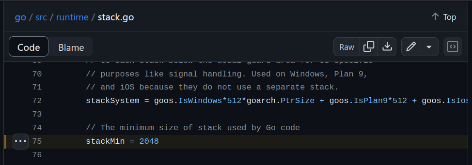




Sabemos que las gorutinas son una de las mas importantes primitivas que Go pone a nuestra disposición para el manejo de concurrencia. Por eso se hace necesaria una forma de prevenir *fugas de gorutinas*.

<!--more-->

Una *fuga* o *leak* de gorutinas es cuando nuestra aplicación crea gorutinas sin tener el cuidado de terminarlas *correctamente*.

Observemos el siguiente ejemplo.

```go

package main

import (
	"fmt"
	"math/rand"
	"runtime"
	"time"
)

func send() int {
	n := rand.Intn(1000)
	time.Sleep(200 * time.Millisecond)
	return n
}

func submit() int {
	ch := make(chan int)

	go func() { ch <- send() }()
	go func() { ch <- send() }()
	go func() { ch <- send() }()
	go func() { ch <- send() }()

	return <-ch
}

func submitAll() {
	for i := 0; i < 5; i++ {
		submit()
	}
}

func main() {
	submitAll()
	fmt.Printf("número de gorutinas: %d\n", runtime.NumGoroutine())
}

```

Si ejecutamos este programa veremos lo siguiente:

```bash
$ go run  main.go 
número de gorutinas: 16
```

Imprime `número de gorutinas: 16` ¿Por que razón? Porque el contenido dle loop se itera 4 veces y en cada iteración engendra 4 gorutinas en la función `submit`. Ingenuamente podriamos estar esperando que al salir del ámbito de la función submit las gorutinas se hubiesen cerrado ¡Pero no es así! ¡Siguen corriendo al final de su proceso como lo demuestra la impresión!

Ahora bien, si nuestra aplicación terminará en este punto, no habría problema alguno, pues al terminar la ejecución del programa ya es responsabilidad del sistema operativo ejecutar las labores de limpieza. Pero, muchas veces usamos Go para construir aplicaciones qeu se ejecutan continuamente sin parar y que se espera que no se detengan, como servicios, apis, etc. En este tipo de aplicaciones, un escenario como el presentado en el ejemplo es insostenible.

Go reserva una cantidad de memoria específica **inicial** para que las gorutinas usen como su [stack](https://go.dev/doc/faq#stack_or_heap), si bien esta cantidad puede variar de versión en versión, la cantidad actual se puede revisar en el [repositorio de GO](https://github.com/golang/go/blob/master/src/runtime/stack.go#L75)




Este stack puede ir creciendo según el proceso que se ejecute dentro de la gorutina. 

## El problema

Entonces, ¿Que pasará si nuestra aplicación sufre de fuga de gorutinas y engendra 100000 de ellas durante un periódo de un año sin terminarlas correctamente?

Pues asumiendo optimistamente que el proceso que se ejecuta dentro de nuestras gorutinas fugadas devuelven correctamente la memoria, y que el stack asignado a cada una de ellas sigue teniendo un tamaño de 2kB, tendriamos para ese momento cerca de **200MB** que no podrán ser recuperados por el recolector de basura ¡Porque las gorutinas todavía están ejecutandose!

Si ejecutamos nuestra aplicación en algún tipo de contenedor o máquina virtual con un límite duro de memoría, esto puede llegar a ocasionar [out of memory errors](https://stackoverflow.com/questions/47447225/allocation-error-runtime-out-of-memory)

¿Que podemos hacer?

## Previniendo fugas de gorutinas

Inevitablemente debemos aprender y convertirnos en expertos en el [modelo de memoria de Go](https://go.dev/ref/mem) y en su modelo de concurrencia. Esto es de vital importancia, pues de la misma forma que un carpintero es responsable de usar de forma segura su sierra circular, taladro y otros implementos, nosotros como programadores somos responsables de usar correctamente las herramientas de nuestro oficio.

En esto cae la construcción de tests y benchmarks y el uso profilactico de herramientas de perfilado como [pprof](https://github.com/google/pprof) asegurandonos de que las pruebas se realicen por un periodo de tiempo conveniente, pues no es lo mismo perfilar un servicio el mismo día en que lo lanzamos a correr, que dos meses después.

Otra herramienta muy útil es [goleak](https://github.com/uber-go/goleak) del equipo de [Uber Go](https://github.com/uber-go), que presenta una forma muy simple de testear que nuestras gorutinas se cierren correctamente.

Se usa de la siguiente forma:

1 Debemos importarla a nuestro proyecto  `$ go get -u go.uber.org/goleak`

2 Debemos construir un test que incluya el flujo completo de nuestras gorutinas. Usaremos el mismo ejemplo anterior

Importamos la utilidad y nos aseguramos de invocarla usando defer para que se garantice su ejecución al final de nuestro proceso.

```go
package main

import (
	"testing"

	"go.uber.org/goleak"
)

func TestGorutineLeak(t *testing.T) {
	defer goleak.VerifyNone(t)

	for i := 0; i < 4; i++ {
		submitAll()
	}
}

```

¡Y listo!,Al ejecutar el test, si goleak detecta fugas de gorutinas, el test fallará

```bash
$ go test ./...

=== RUN   TestGorutineLeak
    /home/jacobopus/projects/go/goru/main_test.go:15: found unexpected goroutines:
        [Goroutine 7 in state chan send, with goru.submit.func1 on top of the stack:
        goru.submit.func1()
        	/home/jacobopus/projects/go/goru/main.go:19 +0x30
        created by goru.submit in goroutine 6
        	/home/jacobopus/projects/go/goru/main.go:19 +0x66
        ]
--- FAIL: TestGorutineLeak (4.46s)
FAIL
```

Puede revisar la [documentación](https://github.com/uber-go/goleak/blob/master/README.md) de goleak para descubrir otras formas de uso


