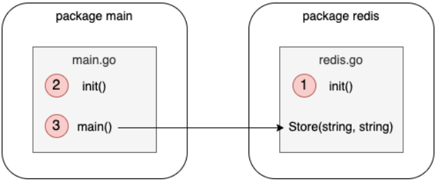



Se comparte el concepto o contexto de algunos errores basicos con su definición acompañado de ejemplo y solución.

<!--more-->

### Indice:

---------------------------------------------------------------------------------

- [Código y organización del proyecto](#código-y-organización-del-proyecto)

---------------------------------------------------------------------------------

# Código y organización del proyecto

### - Sombreado de variable (shadowing) no deseado

La parte de una aplicación donde un enlace de nombre es válido. En Go, un nombre de variable declarado en un bloque se puede volver a declarar en un bloque interno. Este principio, llamado sombreado de variable, es propenso a errores.

**Ejemplo:**

```go
var client *http.Client
if tracing {
    client, err := createClientWithTracing()
    if err != nil {
        return err
    }
    log.Println(client)
} else {
    client, err := createDefaultClient()
    if err != nil {
        return err
    }
    log.Println(client)
}
```
* 1 Declarar una variable client
* 2 Crear un cliente HTTP con tracing habilitado, la variable client está sombreada en este bloque
* 3 Crear un cliente HTTP predeterminado, la variable client también se sombrea en este bloque

Como resultado, de este ejemplo, la variable externa siempre será nula.

**Solución:**

La primera opción es usar variables temporales en los bloques internos:

```go
var client *http.Client
if tracing {
    c, err := createClientWithTracing()
    if err != nil {
        return err
    }
    client = c
} else {
    // Same logic
}          
```
* 1 Crear una variable temporal c
* 2 Asignar esta variable temporal a client

Otra opción es usar el operador de asignación (=) en los bloques internos para asignar directamente los resultados de la función a la variable. Sin embargo, requiere crear una variable de error ya que el operador de asignación solo funciona si ya se ha declarado un nombre de variable:

```go
var client *http.Client
var err error
if tracing {
    client, err = createClientWithTracing()
    if err != nil {
        return err
    }
} else {
    // Same logic
}    
```
* 1 Declarar una variable de error
* 2 Usar operador de asignación para asignar el *http.Client devuelto a la variable client directamente

### - Código anidado innecesario

Un aspecto crítico de la legibilidad es el número de niveles anidados. Un código se califica como legible en función de múltiples criterios, como el nombrado, la consistencia, el formato, etc. Un código legible requerirá menos esfuerzo cognitivo para mantener un modelo mental; por lo tanto, será más fácil de leer y mantener.

**Ejemplo:**

Tiempo o dificultad para entender la siguiente función a detalle.

```go
func join(s1, s2 string, max int) (string, error) {
    if s1 == "" {
        return "", errors.New("s1 is empty")
    } else {
        if s2 == "" {
            return "", errors.New("s2 is empty")
        } else {
            concat, err := concatenate(s1, s2)
            if err != nil {
                return "", err
            } else {
                if len(concat) > max {
                    return concat[:max], nil
                } else {
                    return concat, nil
                }
            }
        }
    }
}

func concatenate(s1 string, s2 string) (string, error) {
    // ...
}
```

**Solución:**

Hacer la tarea de aplicar legibilidad y consistencia sobre la misma función, implementandola de manera diferente:

```go
func join(s1, s2 string, max int) (string, error) {
    if s1 == "" {
        return "", errors.New("s1 is empty")
    }
    if s2 == "" {
        return "", errors.New("s2 is empty")
    }

    concat, err := concatenate(s1, s2)
    if err != nil {
        return "", err
    }
    
    if len(concat) > max {
        return concat[:max], nil
    }
    
    return concat, nil
}

func concatenate(s1 string, s2 string) (string, error) {
    // ...
}
```
* El resultado para requerir menos carga cognitiva.

### - Mal uso de las funciones init

En principio init es una función que no toma argumentos y no devuelve ningún resultado (una función func()). Cuando se inicializa un paquete, se evalúan todas las declaraciones de constantes y variables del paquete. El principal problema reside cuando se ha creado un flujo de uso que se vuelve dificil de entender o seguir y por falta de entendimiento se provocan errores no manejados que se volveran dificiles de mitigar o controlar.

**Ejemplo:**

Olvidar o no haber entendido el sentido o punto de entrada para ejecuion de init.

```go
package main

import "fmt"

var a = func() int {
    fmt.Println("var")
    return 0
}()

func init() {
    fmt.Println("init")
}

func main() {
    fmt.Println("main")
}
```
*Salida*
- 1: var
- 2: init
- 3: main

Ejemplo de flujo usando Redis en base de codigo personal.



**Solución:**

Hay criterios en sentido idiomatico como:

- Evitar incluir funciones init en codigo que sera probado con paquete de testing.

- No hacer que sean de ambito global a menos que sea realmente requerido.

- Evitar usar para conexiones a base de datos.

- Investigar situaciones en las que pueden ser útiles, como definir una configuración estática. De lo contrario, y en la mayoría de los casos, manejar las inicializaciones a través de funciones personalizadas.

# Ebook recomendado:

- [100 Go Mistakes](https://www.manning.com/books/100-go-mistakes-and-how-to-avoid-them)

Que trata a fondo algunos errores sobre: Tipos de datos, Estructuras de control, Strings en detalle, Funciones y métodos, Manejo de errores, Concurrencia: Fundamentos y Práctica, Librería estándar, Pruebas
 y Optimizaciones