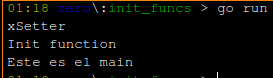



Cada programa en Go debe tener un paquete **main** con una función **main** para ser ejecutado. Sin embargo, esto impone algunas limitaciones para determinadas soluciones, como las librerías. Imagina que importamos una librería a nuestro código. 

<!--more-->

Una librería no está diseñada para ser ejecutada, ofrece estructuras de datos, métodos, funciones, etc. Es probable que las librerías ni siquiera tengan un paquete **main**. Si esta librería requiere alguna configuración inicial antes de ser invocada (inicializar variables, detectar el sistema operativo, etc.) parece imposible.

Go define las funciones **init** que se ejecutan una vez por paquete. Cuando importamos un paquete, el tiempo de ejecución (runtime) de Go sigue este orden:

1. Inicializar los paquetes importados de forma recursiva.
2. Inicializar y asignar valores a las variables.
3. Ejecutar las funciones de **init**.

## Ejemplos:

**1. -** En el resultado para el código de ejemplo se muestra cómo la inicialización sigue el orden descrito anteriormente. La función **xSetter** se invoca primero, seguida de **init** y la función **main**.

```go
package main 

import "fmt" 

var x = xSetter() 

func xSetter() int { 
    fmt.Println("xSetter") 
    return 42 
} 

func init() { 
    fmt.Println("Init function") 
} 

func main() { 
    fmt.Println("Este es el main") 
}
```

### Salida en ejecución:



La función **init** no tiene argumentos ni devuelve ningún valor. Un paquete puede tener varias funciones **init** y *no se pueden invocar desde ninguna parte del código*.

Go no permite importar un paquete si no se usa dentro del código. Sin embargo, es posible que solo nos interese ejecutar las funciones **init** de un paquete. Esto es lo que Go llama los efectos secundarios de un paquete (*side effects pkg*). Por lo general, esto se hace en paquetes que realizan alguna operación de arranque o registro. La instrucción especial **import _** solo llama a las funciones **init** de un paquete que no requiere su uso dentro del código.

**2. -** Ejemplo usando *import _* :  importado el paquete "**a**" para utilizar sus efectos secundarios. Observar que este paquete tiene dos funciones **init** que se ejecutan antes del **init** del paquete de importación. [*go mod init ejemplo2*]

**ejemplo2/main.go**
```go
package main 

import ( 
    "fmt"

    _ "ejemplo2/a" 
) 

func init() { 
    fmt.Println("Init desde mi programa")
} 

func main() { 
    fmt.Println("Mi programa") 
}
```

**ejemplo2/a/a.go**
```go
package a 

import "fmt" 

func init() { 
    fmt.Println("Init 1 desde paquete a") 
} 

func init() { 
    fmt.Println("Init 2 desde paquete a") 
}
```

### Salida en ejecución:

