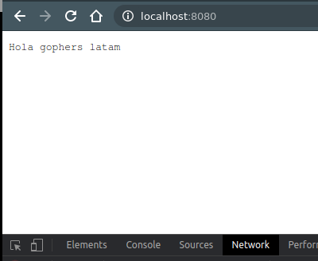
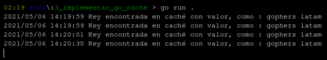



El almacenamiento en caché de datos en una aplicación web a veces es necesario para evitar solicitar datos estáticos de una base de datos o un servicio externo una y otra vez. Go no proporciona ningún paquete integrado en la librería estándar para almacenar en caché las respuestas, pero lo admite a través de paquetes externos creados por la comunidad.

<!--more-->

Hay una serie de paquetes, como [**github.com/coocood/freecache**](https://github.com/coocood/freecache), [**github.com/patrickmn/go-cache**](https://github.com/patrickmn/go-cache), [**github.com/eko/gocache**](https://github.com/eko/gocache) y [**github.com/etcd-io/etcd**](https://github.com/etcd-io/etcd) (gRPC) que pueden ayudar a implementar el almacenamiento en caché. Por parte de la comunidad de **Gophers LATAM** se busca crear algo relacionado: [**github.com/gophers-latam/GoKey**](https://github.com/gophers-latam/GoKey)

Para este post se estará usando **github.com/patrickmn/go-cache** para implementar un ejemplo de uso.

### Ejemplo:

Primero crear un directorio para el código fuente de prueba e inicializar un go module. [*go mod init cache-example*]

Luego crear archivo **.go**, donde se hará un caché por medio de la librería y se completará con datos sobre el arranque del servidor, de la siguiente manera:

```go
package main

import (
	"fmt"
	"log"
	"net/http"
	"time"

	"github.com/patrickmn/go-cache"
)

const (
	CONN_PORT = "8080"
)

var newCache *cache.Cache

func init() {
	newCache = cache.New(5*time.Minute, 10*time.Minute)
	newCache.Set("gophers", "gophers latam", cache.DefaultExpiration)
}

func getFromCache(w http.ResponseWriter, r *http.Request) {
	gophers, found := newCache.Get("gophers")

	if found {
		log.Print("Key encontrada en caché con valor, como : ", gophers.(string))
		fmt.Fprintf(w, "Hola "+gophers.(string))
	} else {
		log.Print("Key no encontrada en caché : ", "gophers")
		fmt.Fprintf(w, "Key no encontrada en caché")
	}
}

func main() {
	http.HandleFunc("/", getFromCache)

	err := http.ListenAndServe(":"+CONN_PORT, nil)
	if err != nil {
		log.Fatal("error al iniciar el servidor http : ", err)
		return
	}
}
```

- Ejecutar el código.

### Como funciona:

Una vez iniciado, el servidor HTTP comenzará a escuchar localmente en el puerto 8080. Al inicio, la clave con el nombre **gophers** con un valor como **gophers latam** se agregará a la caché.

Al navegar por *http://localhost:8080/* se leerá un valor de key de la caché y lo agregará a *Hola* como se muestra en la siguiente captura de pantalla:



Log en terminal:



Se ha especificado el tiempo de caducidad de los datos de la caché en el programa como 5 minutos, lo que significa que la clave que se ha creado en la caché al iniciar el servidor no estará allí después de 5 minutos. Por lo tanto, acceder a la misma URL nuevamente después de 5 minutos devolverá que la clave no es encontrada en la caché del servidor, de la siguiente manera:


Usando **var newCache** ***cache.Cache**, se declara una caché privada.

Se actualiza la función **init()** donde se crea un caché con 5 minutos de tiempo de vencimiento y 10 minutos de intervalo de limpieza, y se agrega un elemento a caché con una clave como **gophers** con su valor como **gophers latam** y su valor de vencimiento como **0**, lo que significa que se quiere usar el tiempo de vencimiento predeterminado de la caché.

<pre>
Si la duración de la caducidad es menor que 1 (o **NoExpiration**), los elementos de la caché nunca caducan (por default) y deben eliminarse manualmente. Si el intervalo de limpieza es menor que 1, los elementos caducados no se eliminan de la caché antes de llamar a **c.DeleteExpired()**.
</pre>

Para usarse se define el controlador **getFromCache** donde se recupera el valor de una clave en caché. Si se encuentra, se escribe en respuesta HTTP, de lo contrario, se escribe el mensaje *Key no encontrada en caché*.