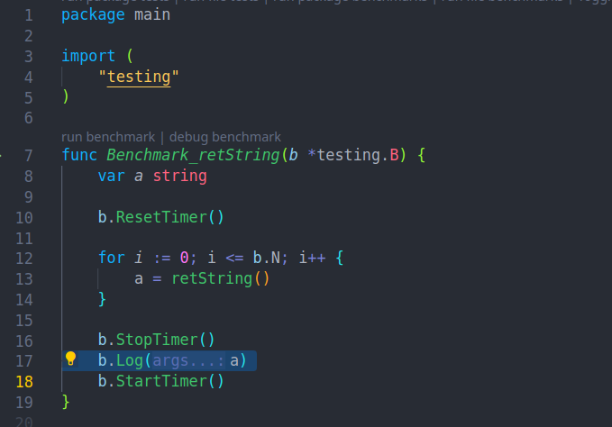




Que Go tiene un recolector de basura integrado lo hemos escuchado muchas veces. Significa que no tenemos que preocuparnos de liberar la memoria que nuestra aplicación usa, pero ¿Deberiamos entender el ciclo de uso de memoria de nuestras aplicaciones? ¿El recolector de basura nos da derecho a olvidar y usar y abusar de ese recurso? 

<!--more-->

Y, primero que nada ¿Que diablos es la memoria de la que tanto se habla?

---
Renuncia de responsabilidades. No es trivial entender la forma en que los computadores trabajan. En aras de poder difundir intentaremos simplificar lo mas posible, en ocasiones, mas alla de lo recomendado.
---

Muchos programadores hemos llegado a Go desde lenguajes de tipado débil, donde hemos tendido a mirar recursos como la memoria como si fueran gratuitos. Nada mas lejos de la verdad, como dice el viejo dicho [No hay tal cosa como un almuerzo gratis](https://es.wikipedia.org/wiki/TANSTAAFL) y si queremos convertirnos en programadores mínimamente competentes debemos tener al menos una idea básica sobre la forma en que se manejan dichos recursos. He ahí la razón de este artículo.

## Memoria virtual

Aquellos que ya tengan la escritura de algunos programas a su haber saben que cuando declaramos una variable, lo que estamos haciendo es asignar un  identificador a una dirección de memoria en la que guardaremos datos (si nunca ha declarado una variable, hagase un favor y vaya al [tour de go](https://go.dev/tour/basics/8)).

Mas o menos cuando hablamos de memoria todos pensamos en una grilla homogenea, con direcciones para acceder a cada casilla comodamente.


Pues bien, esa dirección de memoria no salió del aire por generación espontanea, existe físicamente de alguna forma en alguna parte.

En realidad, lo que llamamos memoria es una **abstracción** proporcionada por el sistema operativo, la cual oculta diferentes medios de almacenamiento.

* [Los registros del procesador](https://es.wikipedia.org/wiki/Registro_(hardware))

* [La caché del procesador](https://es.wikipedia.org/wiki/Cach%C3%A9_de_CPU)

* RAM

* Archivos en disco

* Etc.

En terminos generales, no sabemos en cual de estos medios de almacenamiento quedará almacenada nuestra variable. Solo sabemos que le hemos pedido memoria al sistema y que este nos la presentó adecuadamente para lograr nuestro objetivo. Claro, en aras de la eficiencia hay una gran probabilidad de que nuestro dato haya quedado guardado en RAM.


Esta *abstracción* a la que hicimos referencia, es lo que llamamos **memoria virtual**, es administrada por el sistema operativo y *es un recurso* el cual debe ser solicitado.

---
Memoria virtual es una abstracción que provee a cada proceso la ilusión de que tiene uso exclusivo sobre la memoria principal.
---
*Bryant, R. E. & O’Hallaron, D. R. (2016). Computer System: A Programmer’s Perspective (Third global edition). Pearson Education Limited.*


La organización en forma de *Celdas de memoria* que nos es tan familiar es propia de la memoria virtual y como se imagina para que pueda funcionar se necesita una sofisticada interacción entre el sistema operativo y el hardware. Esta interacción se basa en un *mapeo*, *direccionamiento* o *traslación* entre las direcciones de la memoria virtual y el medio físico donde realmente se encuentre nuestro dato.

Cuando se ejecuta un programa, este tiene una visión uniforme de la memoria, la que llamamos *Espacio de direcciones virtual*, y dentro de este espacio hay dos áreas bien definidas que nos son de vital importancia.   

## Stack y Heap

### Stack

El Stack es una región de la memoria que es *localizada* para cada hilo de ejecución de nuestros programas. En el contexto de Go, decimos que cada gorutina tiene su propio Stack. Su objetivo es contener variables locales, argumentos y valores de retorno de funciones, etc. 

Cuando se invoca una función, se agrega una nueva capa en el Stack y cuando la función termina, esa capa se quita a su vez del Stack.

---
Llamamos *Localización/Allocation* al proceso de reservar memoria para almacenar nuestros datos, y *Deslocalización/Deallocation* al proceso de liberarla una vez que ya no la necesitamos.
---

El Stack tiene la ventaja de que permite acceder rápidamente a la memoria, ¡claro! porque los datos más recientes están siempre en la capa superior. Además, como cuando una función termina su ejecución, su capa asociada en el Stack se quita, ¡La memoria utilizada para los datos en esa capa se ve *automáticamente deslocalizada*!

El Stack empieza con espacio pre-localizado de un tamaño fijo, si el runtime detecta que se está quedando sin espacio, localiza más y como la memoría está localizada de antemano, guardar datos en el Stack es barato y automático.

[](https://github.com/golang/go/blob/master/src/runtime/stack.go#L75)

Para que una variable sea asignada en el Stack, deben cumplirse una serie de requisitos:

* Tamaño fijo, conocido en tiempo de compilación

* El runtime de Go debe ser capaz de determinar completamente su ciclo de vida

* Su tamaño no debe superar la capacidad máxima del Stack (mas las salvaguardas del runtime)

---
El Stack es rápido, localizar y dealocalizar en el es barato.
---

Si estas y otras condiciones no son cumplidas, la variable escapará al Heap.

### Heap

El Heap es el área del espacio de direcciones virtual que el runtime de Go solicita para almacenar los datos al ejecutar nuestro programa. El Heap crece dinámicamente y su objetivo es contener los datos que necesitamos persistan mas allá del tiempo de vida de una función o que son muy grandes para ser alojados en el stack.

El que nuestros datos *escapen* al Heap es costoso porque implica una *localización*, lo que significa que:

1 Se verifica que el Heap tenga suficiente capacidad para el valor que almacenaremos en el.

2 Si el punto 1 no se cumple, se debe solicitar más memoria al sistema operativo para el Heap. Se produce una [System Call](https://www.man7.org/linux/man-pages/man2/syscalls.2.html) solicitando el recurso. En el mundo real este paso se realiza independientemente. El runtime monitorea constantemente el Heap y algunos algoritmos implementan un una *meta*, un límite de memoria, que una vez alcanzado o sobrepasado produce la solicitud de mas recursos al sistema operatvo.

3 Se localiza la memoria en el Heap (por simplicidad incluyamos en este apartado la escritura de los datos que guardaremos).

4 Se almacena en el Stack un puntero a la dirección de memoria inicial de la localización en el Heap.

---
El Heap es flexible, pero la flexibilidad viene con un costo
---

¡Todo esto es bastante trabajo para guardar un monton de datos! ¡Sea parsimonioso! Si, porque localizar en el Heap, si bien proporciona muchas ventajas, tiene un costo. Es por eso que en el ecosistema de Go usted encontrará librerías que se jactan de tener cero localizaciones, es decir, estan escritas tan cuidadosamente que no guardan datos en el Heap, sólo usan el Stack.


## Escapando al Heap

Revisemos el siguiente código


*main.go*

```go
package main

func retString() string {
	retVal := "achu"
	return retVal
}

```

Hemos definido una función que devuelve un string. Construyamos un benchmark para que la podamos analizar.


*main_test.go*

```go
package main

import (
	"testing"
)

func Benchmark_retString(b *testing.B) {
	var a string

	b.ResetTimer()

	for i := 0; i <= b.N; i++ {
		a = retString()
	}

	b.StopTimer()
	b.Log(a)
	b.StartTimer()
}

```

Al ejecutar el benchmark veremos algo parecido al siguiente reporte

```bash
$ go test -bench . -benchmem                  
goos: linux
goarch: amd64
pkg: exmem
cpu: Intel(R) Core(TM) i7-10700 CPU @ 2.90GHz
Benchmark_retString-16          1000000000               0.3356 ns/op          0 B/op          0 allocs/op
```

Donde el benchmark nos informa con `0 allocs/op` que han ocurrido 0 localizaciones al heap.


Reunamos más información. Agreguemos al comando el flag `-gcflags "-m -m"` que hará que el compilador realice un *análisis de escape*, el cual nos informará de movimientos de datos al heap.

```bash
$ go test -gcflags "-m" -bench . -benchmem  
# exmem [exmem.test]
./main.go:3:6: can inline retString
./main_test.go:13:16: inlining call to retString
./main_test.go:7:26: leaking param: b
./main_test.go:17:7: ... argument does not escape
./main_test.go:17:8: a escapes to heap
# exmem.test
_testmain.go:37:6: can inline init.0
_testmain.go:45:24: inlining call to testing.MainStart
_testmain.go:45:42: testdeps.TestDeps{} escapes to heap
_testmain.go:45:24: &testing.M{...} escapes to heap
goos: linux
goarch: amd64
pkg: exmem
cpu: Intel(R) Core(TM) i7-10700 CPU @ 2.90GHz
Benchmark_retString-16          1000000000               0.3356 ns/op          0 B/op          0 allocs/op
```


Continua reportandonos 0 localizaciones, pero ha agregado información interesante. Observe la siguiente línea en el reporte:

```bash
./main_test.go:17:8: a escapes to heap
```

Nos indica que la variable `a` escapa al Heap ¡Y nos dice el lugar exacto donde este escape ocurre!



La línea 17 de nuestro archivo de benchmark, precisamente donde pasamos la variable al logger.

Esto demuestra que el escape no es producto de nuestro código pues el log de la variable está ahí solo como medio informativo y no es parte del mismo.

Construyamos otra función, esta vez una que devuelva un puntero a una variable local.

```go
func rePointerToString() *string {
	retVal := "achu"
	return &retVal
}
```

Y agreguemos el benchmark correspondiente.

```go
func Benchmark_retPointerToString(b *testing.B) {
	var a *string

	b.ResetTimer()

	for i := 0; i <= b.N; i++ {
		a = rePointerToString()
	}

	b.StopTimer()
	b.Log(a)
	b.StartTimer()
}
```

Al ejecutar el benchmark veremos un reporte parecido a lo que sigue:

```bash
goos: linux
goarch: amd64
pkg: exmem
cpu: Intel(R) Core(TM) i7-10700 CPU @ 2.90GHz
Benchmark_retPointerToString
Benchmark_retPointerToString-16    	50917658	        24.86 ns/op	      16 B/op	       1 allocs/op
PASS
ok  	exmem	1.292s
```

¡Una localización que reserva 16 bytes! Agreguemos un nivel más al análisis con `-gcflags "-m"`

```bash
./main.go:3:6: can inline retString
./main.go:8:6: can inline rePointerToString
./main_test.go:13:16: inlining call to retString
./main_test.go:27:24: inlining call to rePointerToString
./main.go:9:2: moved to heap: retVal
./main_test.go:7:26: leaking param: b
./main_test.go:17:7: ... argument does not escape
./main_test.go:17:8: a escapes to heap
./main_test.go:21:35: leaking param: b
./main_test.go:27:24: moved to heap: retVal
./main_test.go:31:7: ... argument does not escape
# exmem.test
_testmain.go:39:6: can inline init.0
_testmain.go:47:24: inlining call to testing.MainStart
_testmain.go:47:42: testdeps.TestDeps{} escapes to heap
_testmain.go:47:24: &testing.M{...} escapes to heap
goos: linux
goarch: amd64
pkg: exmem
cpu: Intel(R) Core(TM) i7-10700 CPU @ 2.90GHz
Benchmark_retPointerToString
Benchmark_retPointerToString-16         49800909                25.77 ns/op           16 B/op          1 allocs/op
```

Otra vez podemos ver varias cosas interesantes:

```bash
./main.go:9:2: moved to heap: retVal
...
./main_test.go:17:8: a escapes to heap
...
./main_test.go:27:24: moved to heap: retVal
...
```

En el archivo *main.go*, donde definimos la función `rePointerToString` el análisis de escape nos informa que en la línea 9, donde definimos a la variable `retVal` como un string, el compilador ha movido la variable al Heap ¡Cuando aún no hemos devuelto su puntero! ¡Lo hacemos recien en la línea 10! ¡Claro! el compilador ha detectado que devolveremos un puntero al valor string almacenado en la variable local, por lo que ha determinado almacenar a la variable en el Heap directamente ¡Aun antes de que se produzca el retorno del puntero!

Hablar sobre memoria y otros temas relacionados con arquitectura de computadores es apasionante, pero es para nunca terminar. 

Recapitulando, hemos dado un recorrido introductorio a vuelo de pajaro sobre la memoria revisando al Stack y al Heap, con algunos ejemplos en código. Conocimos al flag `-gcflags "-m"` para agregar análisis de escape a nuestros tests y benchmarks.

Si le gustó este artículo no olvide compartirlo.